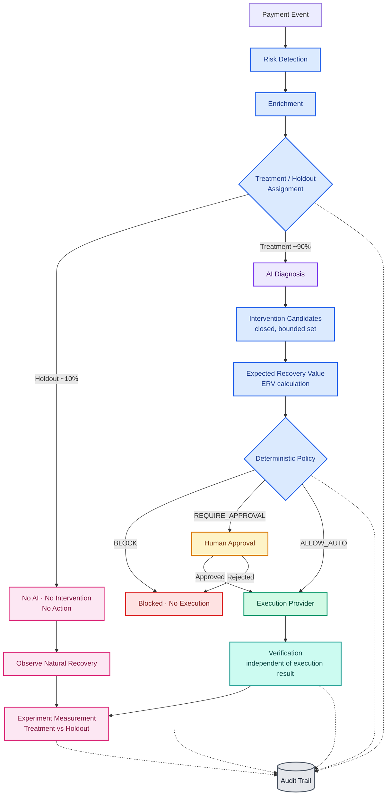

# Reclaim — Architecture / Decision Flow

This diagram is GitHub-renderable (paste directly into any `.md` file, or view this
file on GitHub). It distinguishes **AI reasoning**, **deterministic authorization**,
**human approval**, **execution**, **verification**, **experimentation**, and **audit**
by color, and shows the Treatment vs. Holdout split explicitly — Holdout never touches
AI, intervention, policy, or execution.

### Legend

| Color | Meaning |
|---|---|
| 🟣 Purple | AI reasoning (diagnosis + advisory probability only) |
| 🔵 Blue | Deterministic logic (detection, enrichment, assignment, candidate generation, ERV, policy) |
| 🟡 Amber | Human approval |
| 🟢 Green | Execution (provider abstraction) |
| 🟦 Teal | Verification (independent of execution) |
| 🌸 Pink | Experimentation / Holdout observation |
| ⬛ Gray | Audit trail (append-only, cross-cutting) |
| 🔴 Red | Blocked / no execution |

**Read the diagram left-to-right as a rule, not a suggestion:** the AI node only ever
feeds the deterministic Intervention Candidates step — there is no edge from AI
directly to Execution. Holdout cases physically cannot reach the AI, Policy, or
Execution nodes; the only path out of Holdout is "observe and measure."
